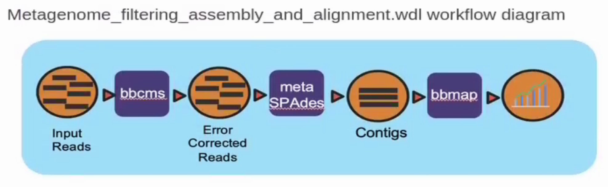

# Summary

## Introduction

Thist repository contains workflows for metgenomic filtering, assembly, and mapping ,and a
combined workflow which runs all components together.  The workflow is written in [Workflow Definition Language](https://openwdl.org) (WDL) and uses [Cromwell](https://cromwell.readthedocs.io/en/stable/), a workflow management system developted by Broad Institute, to execute the workflow.  

Workflows are intended to run on 2x150 bp Illumina datasets.

## Included wdls
**rqcfilter2.wdl** - performs quality control filtering on Illumina datasets using BBTools

**metagenome_assy.wdl** - performs external error correction using bbcms from BBTools, followed by assembly with metaSPAdes

**mapping.wdl** - performs mapping of short reads to an assembly  using bbmap from BBTools

**Metagenome_filtering_assembly_and_alignment.wdl** - executes filtering, error correction, assembly, and mapping

## External bioinformatics tools used
BBTools (https://sourceforge.net/projects/bbmap/)

SPAdes (https://github.com/ablab/spades)



## Installation instructions
### prerequisites
- Git version 2.18.4 or higher
- Cromwell version 47 or higher
- Docker version 19.03.6-ce or higher
- Java version 1.8.0_152-release or higher
- wget

Recommended test dataset
Zymobiomics mock-community DNA control ([SRR7877884](https://www.ebi.ac.uk/ena/browser/view/SRR7877884))

### Example instructions for installing and running the metagenome assembly pipeline on Amazon Web Services

- Launch an instance using an AMI that includes docker ( ie amzn-ami-2018.03.20200205-amazon-ecs-optimized - ami-0683e2d253e41f366). The test data provided can be run with a r5.4xlarge instance with 300G of storage mounted to / (root). See [current pricing](https://aws.amazon.com/ec2/pricing/on-demand/).
- Connect to your ec2 instance using ssh.


```
# install wget.
sudo yum install wget -y

# Download and install anaconda.
wget https://repo.continuum.io/miniconda/Miniconda3-latest-Linux-x86_64.sh
bash Miniconda3-latest-Linux-x86_64.sh -b -p $PWD/miniconda3
source miniconda3/etc/profile.d/conda.sh && conda activate

# Install git and cromwell.
conda install -c conda-forge git cromwell jq -y

# Change directory to /tmp and download code.
cd /tmp; git clone https://code.jgi.doe.gov/BFoster/jgi_meta_wdl

# Fetch test data.
wget ftp://ftp.sra.ebi.ac.uk/vol1/fastq/SRR787/004/SRR7877884/SRR7877884_2.fastq.gz
wget ftp://ftp.sra.ebi.ac.uk/vol1/fastq/SRR787/004/SRR7877884/SRR7877884_1.fastq.gz

# Interleave fastq data.
docker run --volume $PWD:/data -w /data bryce911/bbtools:38.86 reformat.sh in=SRR7877884_1.fastq.gz in2=SRR7877884_2.fastq.gz out=SRR7877884.fastq.gz

# Download rqcfilter dataset (~2hours).
mkdir data; cd data; wget -O - http://portal.nersc.gov/dna/metagenome/assembly/rqcfilter/RQCFilterData.tar | tar -xf - ; cd ..

# Make an inputs.json file containing the the path to the test data.
echo '{"metagenome_filtering_assembly_and_alignment.input_files": ["/tmp/SRR7877884.fastq.gz"]}' > inputs.json

# Run pipeline.
cromwell -Dconfig.file=jgi_meta_wdl/local.conf run -i inputs.json -m output.metadata.json jgi_meta_wdl/metagenome_filtering_assembly_and_alignment.wdl

# display outputs
jq .outputs output.metadata.json

```

### Output files

#### Final contigs and fasta files:
- call-assy/metagenome_assy.metagenome_assy/*/call-create_agp/assembly.contigs.fasta
- call-assy/metagenome_assy.metagenome_assy/*/call-create_agp/assembly.scaffolds.fasta

#### Alignment files of input reads mapped to contigs:
- call-mapping/mapping.mapping/*/call-finalize_bams/pairedMapped_sorted.bam
- call-mapping/mapping.mapping/*/call-finalize_bams/pairedMapped_sorted.bam.cov
- call-mapping/mapping.mapping/*/call-finalize_bams/pairedMapped_sorted.bam.flagstat

